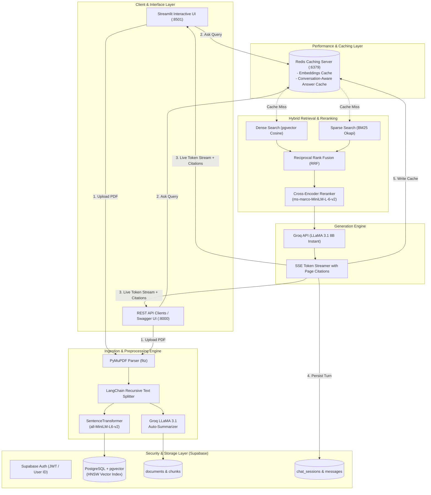

<div align="center">

# REFERA

### **Production-Grade Multi-Document AI Research Assistant**
*Enterprise-ready Hybrid RAG (pgvector + BM25 RRF + Cross-Encoder) with Sub-Second Streaming Generation, Redis Caching, and Supabase Authentication.*

</div>

---

## 📖 Table of Contents

- [Overview](#-overview)
- [System Architecture](#-system-architecture)
- [Key Features](#-key-features)
- [Tech Stack](#-tech-stack)
- [Project Structure](#-project-structure)
- [Database Setup & Schema](#-database-setup--schema)
- [Quickstart Guide](#-quickstart-guide)
  - [Prerequisites](#prerequisites)
  - [Local Installation](#local-installation)
  - [Environment Configuration](#environment-configuration)
- [Running the Application](#-running-the-application)
  - [1. Streamlit Interactive Web App](#1-run-streamlit-frontend)
  - [2. FastAPI REST Backend](#2-run-fastapi-backend)
  - [3. Full-Stack Docker Deployment](#3-run-with-docker-compose)
  - [4. Evaluation & Benchmarking](#4-run-rag-evaluation-suite)
- [RAG Pipeline Deep Dive](#-rag-pipeline-deep-dive)
- [REST API Reference](#-rest-api-reference)
- [Evaluation & Metrics](#-evaluation--metrics)
- [Troubleshooting & FAQ](#-troubleshooting--faq)
- [License](#-license)

---

## 🌟 Overview

**ReferA** is an advanced AI research assistant tailored for academics, students, and engineers. It enables users to upload multiple research papers, technical reports, and PDF documents simultaneously, generating strictly grounded answers with verifiable page-level citations.

Unlike basic naive RAG implementations, ReferA employs a **Multi-Stage Hybrid Information Retrieval Pipeline**:
1. **Dense Vector Search** using HuggingFace `all-MiniLM-L6-v2` embeddings in **Supabase pgvector** with an **HNSW** index.
2. **Sparse Lexical Search** using **BM25 Okapi** to ensure exact domain terminology and keyword recall.
3. **Reciprocal Rank Fusion (RRF)** to combine dense and sparse rankings without arbitrary score normalization.
4. **Cross-Encoder Reranking** with `ms-marco-MiniLM-L-6-v2` to evaluate full token-level query-context interactions.
5. **Ultra-Low Latency Inference** via **Groq LLaMA 3.1 8B Instant** for real-time token streaming.
6. **Multi-Tier Redis Caching** for query embeddings and conversation context cache-aside lookups.
7. **Cloud Persistence & Security** with Supabase Auth, Row-Level Security (RLS), and multi-tenant isolation.

---

## 🏗 System Architecture



---

## 🛠 Tech Stack

| Domain | Technology / Library | Purpose |
| :--- | :--- | :--- |
| **Language Model** | Groq LLaMA 3.1 8B Instant | Ultra-fast token generation & automated summarization |
| **Embedding Model** | `all-MiniLM-L6-v2` (384-dim) | Dense semantic vector representations |
| **Reranker Model** | `cross-encoder/ms-marco-MiniLM-L-6-v2` | High-precision candidate reranking |
| **Vector Database** | Supabase (PostgreSQL + `pgvector`) | HNSW cosine similarity search & relational data |
| **Lexical Search** | `rank-bm25` (BM25Okapi) | In-memory sparse keyword indexing |
| **Document Parsing** | PyMuPDF (`fitz`) | Fast, accurate PDF text extraction & page boundary tracking |
| **Chunking Engine** | LangChain RecursiveCharacterTextSplitter | Context-preserving recursive text chunking |
| **Caching Layer** | Redis 7 | Embeddings caching & conversation-keyed answer cache |
| **Frontend UI** | Streamlit | Modern responsive academic research interface |
| **Backend API** | FastAPI + Uvicorn | High-performance async REST API with SSE streaming |
| **Containerization** | Docker & Docker Compose | Multi-container full-stack orchestration |

---

## 📂 Project Structure

```plaintext
refera/
├── backend/
│   ├── app.py                     # FastAPI REST server with SSE streaming & CORS
│   ├── Dockerfile                 # Backend container definition
│   ├── requirements.txt           # Backend-specific Python dependencies
│   ├── rag/
│   │   ├── parser.py              # PDF extraction & page boundary tracking (PyMuPDF)
│   │   ├── chunker.py             # Clean recursive character chunking
│   │   ├── embeddings.py          # MiniLM-L6-v2 embeddings with caching
│   │   ├── vectordb.py            # Supabase pgvector operations & document manager
│   │   ├── retriever.py           # Hybrid retrieval (pgvector + BM25) & RRF fusion
│   │   ├── reranker.py            # Cross-encoder candidate reranker
│   │   ├── generator.py           # Groq streaming completion & prompt engine
│   │   ├── summarizer.py          # Structured executive summary generator
│   │   └── cache.py               # Redis connection manager & cache-aside logic
│   └── evaluation/
│       ├── evaluate.py            # Automated RAG benchmarking runner
│       ├── metrics.py             # Semantic similarity, keyword match & retrieval hits
│       └── sample_dataset.py      # Ground-truth evaluation dataset
├── frontend/
│   ├── streamlit_app.py           # Modern Streamlit researcher UI & session manager
│   └── Dockerfile                 # Frontend container definition
├── supabase_schema.sql            # Complete Supabase DDL, pgvector HNSW index & RPC
├── docker-compose.yml             # Full-stack composition (Redis + Backend + Frontend)
├── requirements.txt               # Unified project dependencies
├── .env.example                   # Environment variable template
├── .gitignore                     # Git exclusion rules
└── README.md                      # Comprehensive production documentation
```

---

## 🗄 Database Setup & Schema

ReferA uses **Supabase** with the **pgvector** extension. 

### Step 1: Create a Supabase Project
1. Go to [database.new](https://database.new) and create a free project.
2. Navigate to **Project Settings > API** and copy:
   - **Project URL** (`SUPABASE_URL`)
   - **Anon / Public Key** (`SUPABASE_KEY`)

### Step 2: Execute the Database Migration Script
1. In your Supabase Dashboard, open the **SQL Editor**.
2. Open [`supabase_schema.sql`](supabase_schema.sql) from this repository, copy the full contents, paste it into the editor, and click **Run**.

This script automatically provisions:
- `CREATE EXTENSION IF NOT EXISTS vector;`
- `documents`, `document_chunks`, `chat_sessions`, and `chat_messages` tables.
- An **HNSW index** on 384-dimensional embeddings (`vector_cosine_ops`).
- The `match_document_chunks` stored procedure for pgvector similarity searches with user and filename filters.
- **Row Level Security (RLS)** policies for full data isolation per authenticated user.

---

## 🚀 Quickstart Guide

### Prerequisites
- **Python 3.11 or 3.12** installed on your system.
- A free **[Groq Cloud API Key](https://console.groq.com/)**.
- A free **[Supabase Project](https://supabase.com)** (URL & Publishable Key).
- *(Optional)* **Docker & Docker Compose** for containerized execution.

---

### Local Installation

```bash
# 1. Clone the repository
git clone https://github.com/sujithvaishnav/REFERA.git
cd REFERA

# 2. Create a virtual environment
python -m venv renv

# 3. Activate virtual environment
# Windows (PowerShell):
.\renv\Scripts\Activate.ps1
# Windows (Command Prompt):
.\renv\Scripts\activate.bat
# Linux / macOS:
source renv/bin/activate

# 4. Install dependencies
pip install -r requirements.txt
```

---

## 💻 Running the Application

### 1. Run Streamlit Frontend
Launch the interactive web application:

```bash
streamlit run frontend/streamlit_app.py
```
👉 Open your browser at **`http://localhost:8501`**

#### Using the App:
1. **Sign Up / Sign In**: Create an account with your email and password.
2. **Upload Research Papers**: Use the sidebar to upload one or more PDFs. The app will extract pages, generate embeddings, build the BM25 index, and present an executive summary.
3. **Query with Citations**: Type your question in the chat input. Watch the tokens stream in real-time and expand the **Verified Document Citations** accordion to view the exact page snippets.
4. **Manage Sessions**: Switch between chat sessions or start fresh research threads at any time.

---

### 2. Run FastAPI Backend
Launch the high-performance REST API with interactive Swagger docs:

```bash
uvicorn backend.app:app --host 0.0.0.0 --port 8000 --reload
```
👉 Access the Interactive API Documentation at **`http://localhost:8000/docs`**

---

### 3. Run with Docker Compose
Start the complete stack (Redis 7 + FastAPI Backend + Streamlit UI) in one command:

```bash
docker-compose up --build
```
- **Streamlit Frontend**: `http://localhost:8501`
- **FastAPI Documentation**: `http://localhost:8000/docs`
- **Redis Cache**: `localhost:6379`

To stop:
```bash
docker-compose down
```

---

### 4. Run RAG Evaluation Suite
Benchmark ReferA's hybrid retrieval accuracy, semantic grounding, keyword match rate, and latency:

```bash
python backend/evaluation/evaluate.py
```
This runs a 10-query benchmark dataset against the RAG pipeline and prints a detailed score summary:
```
============================================================
  AVERAGE BENCHMARK SCORES
============================================================
  • semantic_similarity      : 0.884
  • keyword_match            : 0.917
  • retrieval_hit            : 1.000
  • latency_seconds          : 0.820
============================================================
Results saved to: backend/evaluation/evaluation_results.csv
```

---

## 🔬 RAG Pipeline Deep Dive

```
 ┌─────────────┐     ┌──────────────┐     ┌──────────────┐     ┌──────────────┐
 │ User Query  │ ──► │ Dense Search │ ──┐ │ Reciprocal   │ ──► │ Cross-Encoder│ ──► ┌─────────────┐
 └─────────────┘     │  (pgvector)  │   ├─│ Rank Fusion  │     │   Reranker   │     │ Groq LLaMA  │
                     └──────────────┘   │ │    (RRF)     │     │  (Top-5)     │     │ 3.1 Stream  │
                     ┌──────────────┐   │ └──────────────┘     └──────────────┘     └─────────────┘
                     │    BM25      │ ──┘
                     │ Sparse Search│
                     └──────────────┘
```

### 1. Ingestion & Page Boundary Preservation
PDFs are parsed with PyMuPDF. Text is split using LangChain's `RecursiveCharacterTextSplitter` (chunk size: `1200`, overlap: `200`). Each chunk retains its verified 1-indexed source page number.

### 2. Dense Semantic Search
Each text chunk is mapped into a 384-dimensional dense vector using `sentence-transformers/all-MiniLM-L6-v2`. Embeddings are indexed in PostgreSQL using an HNSW index with cosine distance (`<=>`).

### 3. Sparse Lexical Search (BM25)
An in-memory BM25 Okapi index is constructed per user. This ensures that exact acronyms, dataset names, model designations, and mathematical formulas that dense models may smooth over are retrieved with high precision.

### 4. Reciprocal Rank Fusion (RRF)
Dense and sparse candidate lists are fused using the formula:
$$\text{RRF Score}(d) = \sum_{m \in \{\text{Dense}, \text{BM25}\}} \frac{1}{k + r_m(d)}$$
*(where $k = 60$ and $r_m(d)$ is the rank of document $d$ in system $m$)*.

### 5. Cross-Encoder Reranking
Top candidates from RRF are scored by `cross-encoder/ms-marco-MiniLM-L-6-v2`. Cross-encoders perform joint full-attention over `[Query, Passage]` pairs, producing more accurate relevance rankings than bi-encoder cosine similarity alone.

### 6. Streaming Generation & Inline Citations
The top-5 reranked chunks are assembled into a structured prompt enforcing strict grounding rules. The prompt is sent to Groq (`llama-3.1-8b-instant`), which streams tokens with millisecond time-to-first-token (TTFT) alongside metadata-verified citation cards.

---

## 📡 REST API Reference

| Method | Endpoint | Description | Query / Body Parameters |
| :--- | :--- | :--- | :--- |
| `GET` | `/` | API Root status | None |
| `GET` | `/health` | Service health & Redis status | None |
| `POST` | `/upload` | Upload & index PDF document | `file: UploadFile`, `user_id: Form(str)` |
| `GET` | `/ask` | Query knowledge base (SSE stream) | `query: str`, `selected_docs: str`, `user_id: str` |
| `GET` | `/documents` | List uploaded user documents | `user_id: str` |
| `DELETE` | `/documents/{id}` | Delete document and cascaded chunks | `document_id: str`, `user_id: str` |

### Sample cURL Commands

#### 1. Upload a PDF
```bash
curl -X POST "http://localhost:8000/upload" \
  -H "X-User-ID: 123e4567-e89b-12d3-a456-426614174000" \
  -F "file=@/path/to/research_paper.pdf"
```

#### 2. Query with Streaming Response
```bash
curl -N "http://localhost:8000/ask?query=What+is+the+core+contribution+of+this+paper%3F&user_id=123e4567-e89b-12d3-a456-426614174000"
```

#### 3. List Documents
```bash
curl "http://localhost:8000/documents?user_id=123e4567-e89b-12d3-a456-426614174000"
```
---

## 📊 Evaluation & Metrics

ReferA includes a standardized evaluation suite ([`backend/evaluation/`](backend/evaluation/)) evaluating four key dimensions:

1. **Semantic Similarity**: Cosine similarity between the generated answer and verified ground-truth using `all-MiniLM-L6-v2`.
2. **Keyword Coverage**: Proportion of critical domain concepts present in the generated answer.
3. **Retrieval Hit Rate**: Binary indicator measuring whether the retrieved context passages contain the requisite knowledge.
4. **End-to-End Latency**: Time elapsed from query submission through hybrid retrieval, reranking, and generation.

---

## 📜 License

This project is open-source and licensed under the [MIT License](LICENSE).

